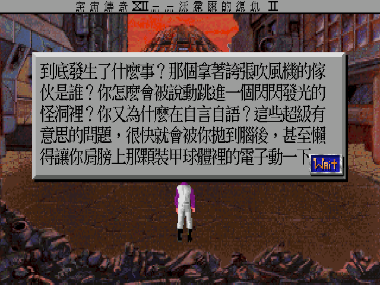
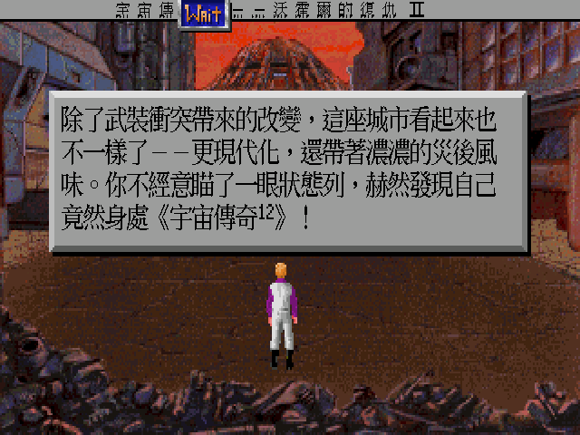
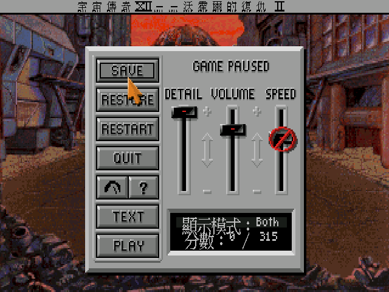

# 宇宙傳奇 IV — 時空穿越者　繁體中文化

《Space Quest IV: Roger Wilco and the Time Rippers》（Sierra On-Line, 1992）CD 語音版的繁體中文化補丁。
對白、旁白、選單與狀態列共 **1,678 則、約 12 萬字元的英文原文**已譯成繁中，遊戲畫面拉到 640×400，
中文用倚天點陣字直接畫進高解析緩衝區，不是把小字放大的馬賽克。


原版的英文語音全部保留：玩的時候是**英文配音配繁中字幕**。



## 這個 repo 有什麼、沒有什麼

只放補丁，**不含遊戲本體**。你需要自備正版的 Space Quest IV CD 版
（`resource.000` / `resource.aud` / `resource.map`；GOG 與 Steam 的 Space Quest 合輯都是這個版本）。

| 目錄 | 內容 |
|---|---|
| `patches/` | ScummVM 引擎改動（`0001-sci-cht-zh_twn.patch` + 新增的 `fontchinese.cpp/h`） |
| `dist-cht/` | 執行期中文資料：`translation.tsv`（Big5）、中文標題疊圖 `sq4_title.ovl` |
| `translation/` | 翻譯原始資料：抽字骨架、UTF-8 譯文、譯名表、批次檔 |
| `tools/` | 抽字、烘字型、合併譯文、疊圖、實機擷取的腳本 |
| `docs/` | 實作筆記（SCI1.1 踩到的雷與判斷依據） |

字型檔（`sq4_big5.fnt` / `sq4_big5_hi.fnt`）**不在 repo 裡**，因為它是從倚天中文系統的點陣字模烘出來的。
用 `tools/build_eten_font.py` 自己烘（需要倚天 3.53 的 `STDFONT.15`、`SPCFONT.15`、`STD.24M`、`SPCFONT.24`），
或用 `tools/build_cht.py` + `tools/bake_hires_font.py` 從開源的 AR PL UMing 烘一份。兩者的差別見下方「字型」。

## 怎麼用

```bash
# 1) 取得 ScummVM 原始碼並套上補丁（腳本會自動 clone 到 pinned commit）
tools/apply_patches.sh scummvm-src

# 2) 編譯（docker 內；MT-32 模擬必須開著，不要加 --disable-mt32emu）
cd scummvm-src
./configure --disable-all-engines --enable-engine=sci --disable-detection-full
make -j$(nproc)

# 3) 烘字型（擇一）
python3 tools/build_eten_font.py translation/translation.tsv dist-cht --prefix sq4   # 倚天，較好看
# 或：從開源字型烘
python3 tools/build_cht.py translation/translation.tsv dist-cht --prefix sq4 --size 15
python3 tools/bake_hires_font.py dist-cht/sq4_big5_hi.fnt translation/translation.tsv \
        --width 24 --height 24 --size 23

# 4) 把 dist-cht/ 的四個檔（translation.tsv、兩個 .fnt、sq4_title.ovl）放進遊戲目錄
```

**中文要靠 target 設定啟用，不是命令列參數**。在 `scummvm.ini` 的遊戲條目裡加 `language=tw`：

```ini
[sq4-cht]
engineid=sci
gameid=sq4
path=/path/to/sq4
language=tw
subtitles=true
speech_mute=false
```

SCI1.1 的偵測器會在偵測階段就用語言過濾條目，命令列 `--language=tw` 反而會讓遊戲認不出來。

MT-32 音樂：ScummVM 音效選項選 Roland MT-32，並把自備的 `MT32_CONTROL.ROM` / `MT32_PCM.ROM` 放進遊戲目錄。
**ROM 有版權，不會出現在這個 repo 或任何釋出包裡。**

## 譯名

人名沿用本團隊《宇宙傳奇 III》繁中版，地名採 1992 年軟體世界代理版中文說明書（珍藏版 96）。
兩邊有出入時的取捨列在下面，完整表在 `translation/GLOSSARY.md`。

| 英文 | 本作採用 | 另一種說法 |
|---|---|---|
| Roger Wilco | 羅傑·威爾科 | 羅傑·威克（1992 說明書） |
| Xenon | 氙星（1992 說明書） | 澤農（SQ3 繁中版） |
| Buckazoids | 太空幣 | — |
| Vohaul | 沃霍爾 | — |
| Pestulon | 佩斯圖倫 | — |
| Two Guys from Andromeda | 仙女座雙傑 | — |
| Sequel Police | 續集警察 | — |
| Monolith Burger | 巨石漢堡 | — |

翻譯走「梗保留、語氣台化」：專有名詞照表譯成中文但不換指涉（Monolith Burger 是「巨石漢堡」，
不會變成麥當勞），句子用台灣口語寫，美式雙關找中文的等效說法。



## 1992 年中文說明書要點

當年軟體世界代理版附的中文說明書（手寫排版，24 頁）。掃描本身有版權，不收進這個 repo，
以下是對玩家還有用的部分。

**圖示指令欄**（滑鼠移到畫面頂端會降下來；右鍵循環切換）

| 圖示 | 說明書用語 | 原文 | 作用 |
|---|---|---|---|
| 走路的人 | 行走 | WALK | 點畫面任一處，主角走過去 |
| 眼睛 | 觀看 | LOOK | 看指定的東西，多數劇情描述靠這個觸發 |
| 手掌 | 動作 | ACTION | 拿取物品或對物品操作 |
| 說話的頭 | 交談 | TALK | 跟人或物交談 |
| 鼻子 | 聞 | SMELL | 聞味道 |
| 舌頭 | 嚐 | TASTE | 嚐味道 |
| 目前物品 | 物品欄 | CURRENT OBJECT | 游標變成選定物品的形狀，移到要用的地方使用 |
| 背包 | 查看物品 | INVENTORY | 也可以直接按 `Tab`；裡面有看／動作／選用物品／求助／完畢五個次選項 |

「聞」和「嚐」不是裝飾——Space Quest 系列很多笑點就藏在對每樣東西聞一次、嚐一次的回應裡，
這次全部都有中文。

**其他**：遊戲不需要輸入任何英文句子，全程滑鼠可玩；說明書建議用滑鼠或搖桿。

## 技術做法

在引擎的繪字咽喉點做**內容比對替換**：拿英文原字當索引查外部的 `translation.tsv`，命中就換成 Big5 中文再畫。
好處是完全不碰原始資源格式，交付物只有 TSV、字型和引擎補丁，原版資源一個位元組都不用改、也不用散布。

幾個 SCI1.1 特有的地方：

- **字串住在 `heap` 不是 `script`**。SCI1.1 把 SCI0 的單一 script 資源拆成 bytecode 和資料段，
  沿用舊工具掃 `script.*` 會整批漏掉玩家看得到的字。
- **狀態列是 runtime 組出來的**，含置中用的填充位元組和特殊字型的羅馬數字，整串查表永遠對不上，
  只能做片段替換。而且那條列只有 10 個掃描列高，24px 的中文字模會被裁掉下緣並溢出到畫面裡——
  狀態列改用 16×15 字模以 1:1 畫進高解析緩衝區才塞得下。
- **視窗大小要用譯文量**。對白視窗的高度是更早的 `kTextSize` 決定的，只在繪製時換中文的話，
  視窗會照英文的行數開，中文較長時就會溢出。

完整的踩雷紀錄在 [`docs/lessons-sq4.md`](docs/lessons-sq4.md)。

## 已知限制

**暫停面板的按鈕維持英文。**



`SAVE` / `RESTORE` / `QUIT` 這些按鈕和 `DETAIL` / `VOLUME` / `GAME PAUSED` 這些標籤都是烘進美術圖的字，
技術上可以解碼重繪。不做的理由是尺寸：按鈕圖塊 50×15，扣掉立體邊框只剩約 11 像素的文字帶，
倚天字模縮到那個高度後筆劃多的字會糊成一團；`DETAIL` 那批更只有 9 像素高，任何中文都不可能可讀。
放大圖塊會打壞腳本寫死的面板版面。與其塞一排糊掉的中文，不如維持英文。
面板裡那個顯示模式／分數的小黑框同理——它的行距是寫死的 9 個掃描列，中文兩行必定重疊。

標題畫面則相反：logo 下方有整片空白，所以中文副標是用疊圖加上去的，沒有蓋掉原本的英文 logo。

## 字型

預設用**倚天中文系統 3.53 的原生點陣字**：對白用 24×24 明體（`STD.24M`），狀態列與標題副標用 16×15
（`STDFONT.15`）。1990 年代 DOS 中文長什麼樣，倚天就長什麼樣；現代 TTF 縮到這個尺寸筆劃比例會不對。
全部用到的 2,141 個字倚天都有，沒有一個字要退回其他字型。

底下是同一句對白的對照，上為倚天、下為 AR PL UMing：


## 授權與致謝

《Space Quest IV》© 1991, 1992 Sierra On-Line, Inc.。本專案與 Sierra / Activision 無任何關聯，
是非商業的繁體中文化與歷史保存。

- **ScummVM**（GPLv3+）：引擎補丁依 GPL 釋出；若釋出修改過的執行檔會一併附上對應原始碼。
- **倚天中文系統**點陣字模：不隨本 repo 散布，需自備。
- 1992 年中文說明書：《軟體世界》珍藏系列 96；掃描檔版權屬原出版者，不收錄於此。
  文字內容由「軟體世界說明書補完計劃」保存流傳。
