# 宇宙傳奇 IV — 時空穿越者　繁體中文化

《Space Quest IV: Roger Wilco and the Time Rippers》（Sierra On-Line, 1992）CD 語音版的繁體中文化補丁。
對白、旁白、選單、狀態列共 **1,677 則、約 12 萬字元**譯成繁中（抽字骨架涵蓋率 99.3%）。
畫面拉到 640×400，中文用**倚天 24 點明體直接畫進高解析緩衝區**，不是把小字放大的馬賽克。
原版的英文語音全部保留：玩起來是**英文配音配繁體中文字幕**。

1992 年，這片在台灣是這樣被賣出去的：

> 前所未有的曲折劇情，充滿驚奇、錯愕以及無數的笑料，不可錯過喔！
>
> ——1992 年《軟體世界》代理版全頁廣告文案

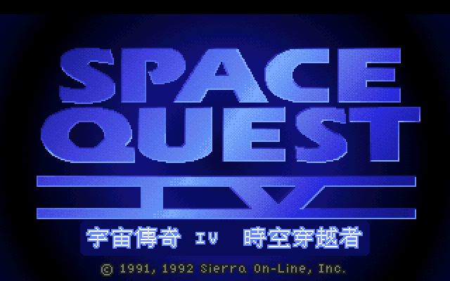

同一年的雜誌專文，還替它多寫了一句：

> 本遊戲同樣也突破傳統，採用最合乎人性化的圖形指令操作方式。玩者無需強背複雜的動作指令，
> 或是搜索枯腸的尋找特定動作或是物品的英文單字。只需利用簡單的幾個指令圖標即可達成遊戲中
> 的各種動作。這種方式最適合國內各階層的玩者，**就算是不懂英文也可玩得盡興**。
>
> ——1992 年雜誌專文〈宇宙傳奇 IV 時空穿越者〉

那句話當年只兌現了一半。圖示指令欄確實免掉了打英文動詞，可是整場的旁白、對白、笑話、
店招牌、死亡訊息還是英文，而 Space Quest 的笑點幾乎全長在那些字裡。
不懂英文的人按得動遊戲，笑不到點上。

這個 repo 是那句廣告詞遲了三十幾年的下半段。

想直接玩，跳到[下載](#download)；想知道 1992 年那一盒裡裝了什麼，就照順序往下讀。

---

<a name="toc"></a>
## 目錄

- [1992 年的那一盒](#the-1992-box)
- [這遊戲到底在玩什麼](#story)
- [中文化成果](#cht)
- [英文原版 ↔ 繁體中文](#compare)
- [推廣片](#promo)
- [下載](#download)
- [中文攻略](#walkthrough)
- [時空艙座標全解 ＋ 線上模擬器](#timepod)
- [防拷](#copy-protection)
- [譯名](#glossary)
- [1992 年中文說明書要點](#manual-1992)
- [字型](#font)
- [技術做法](#tech)
- [這個 repo 有什麼](#repo)
- [授權與致謝](#credits)

---

<a name="the-1992-box"></a>
## 1992 年的那一盒

那則全頁廣告的綠色內文，開頭是這樣寫的：

> 時光機不再只是小叮噹的專利，更非回到未來的票房保證，這次我們那位宇宙英雄羅傑威爾
> （ROGER WILCO），將帶你一同進入穿梭時空的驚奇之旅。

廣告下緣照慣例壓了一排規格框，那是 1992 年台灣玩家真正會盯著看的地方——先確認自己那台
機器跑不跑得動，再決定要不要掏錢：

| 機種 | 記憶體 | 顯示 | 操作 | 類型 | 片數 | 售價 | 備註 |
|---|---|---|---|---|---|---|---|
| IBM PC AT | 640K | VGA | 鍵盤／搖桿／滑鼠 | 冒險 | 六片 1.2M | 380 元 | ☆支援魔奇音效卡 |

380 元、六片 1.2M 磁碟片，換算下來一片磁片扛著六十幾塊錢的內容，中間任何一片壞軌就整包報銷。
VGA 256 色在當年不是預設配備，而是門檻——專文結尾對此毫不客氣：「想享受本遊戲但是沒有以上
設備的朋友們，該趕快存錢為你的電腦昇級了！」魔奇（AdLib 相容）音效卡則是那個年代台灣機殼裡
最常見的那張。這份補丁針對的不是這一盒，而是後來多了英文語音的 CD 版；GOG 與 Steam 的
Space Quest 合輯賣的就是它。

規格看完了，接下來是當年那位編輯怎麼跟讀者形容這片在玩什麼。

---

<a name="story"></a>
## 這遊戲到底在玩什麼

這段不需要重寫，1992 年的原文自己就很好笑：

> 你絕對想不到，這次我們那位宇宙超級大英雄羅傑威爾（ROGER WILCO）在宇宙傳奇 IV 中又將
> 遭遇到那些趣事。這可憐的小子一下子莫名奇妙的被機器戰警追殺，接著又被傳送到宇宙傳奇
> 第十二代的氙星廢墟中去撿垃圾，再來又被那有點「銹兜」的時光機傳送到宇宙傳奇第十代的
> 美人星，去償還不知道是多少年後的自己所留下來的風流債，更絕的是！竟然要堂堂宇宙俠扮
> 女生！接下來呢！如果你還沒學會游泳，勸你趕快學，否則在無重力遊樂場中，那種狗爬式泳
> 姿，可是「遜」死了。還有…一大堆異想天開的美式幽默可不是一般人想得出來的喔！只要你
> 笑神經夠發達，保証讓你笑得忘了我是誰。
>
> ——1992 年雜誌專文〈宇宙傳奇 IV 時空穿越者〉

主角是誰，1992 年的中文說明書封底講得比任何角色設定文都準：

> 何不讓我們那位集勇氣、幽默、機智、卑鄙於一身的宇宙傳奇大英雄羅傑‧威克，帶你一同暢遊
> 輕快笑鬧的科幻宇宙冒險時空呢！
>
> ——1992 年《軟體世界》珍藏系列 96 中文說明書封底

「卑鄙」那兩個字是關鍵。羅傑不是英雄，是個運氣好得離譜的清潔工，全系列的樂趣就在看他
被自己的蠢事推著走完劇情。當年編輯替截圖下的圖說也是這個調性——「哦！我們的大英雄羅傑
好像變成女英雄了！」「相不相信，這大傢伙我只用一瓶氧氣筒就解決了！」

被機器戰警追殺、撿垃圾、扮女生、狗爬式泳姿，這些場景在畫面上都看得懂。看不懂的是講話的
那一半，而那正好是這系列賣的東西。下面是補上之後的樣子。

---

<a name="cht"></a>
## 中文化成果

以下都是實機截圖，排列照遊戲玩下去的先後：開場、旁白、狀態列、暫停面板、圖示欄。

### 開場

一進遊戲就是中文，連「要不要跳過開場」的選項按鈕都是。

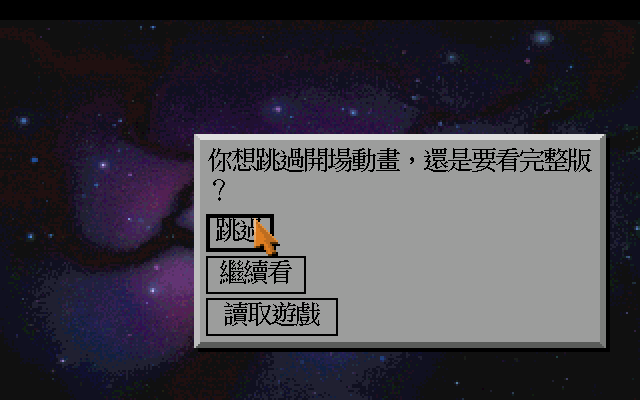

### 旁白與描述

Space Quest 系列的靈魂在旁白——它整場都在酸主角。這些全部有中文。

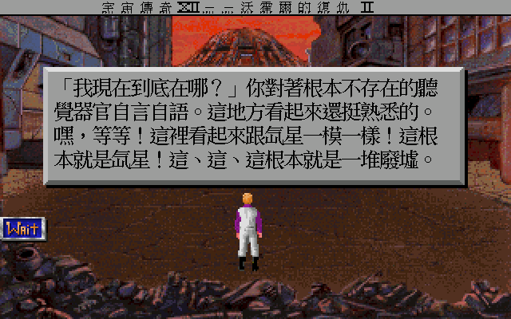

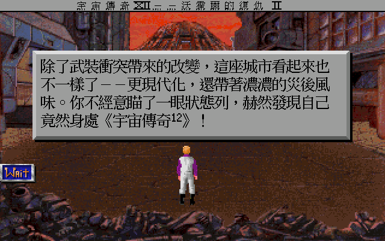

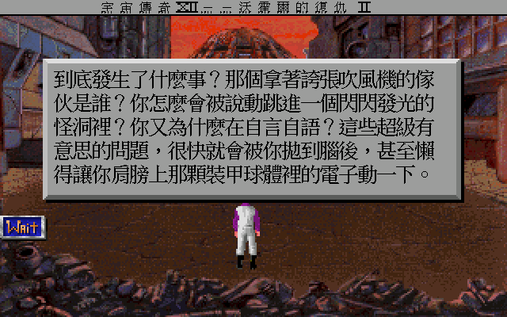

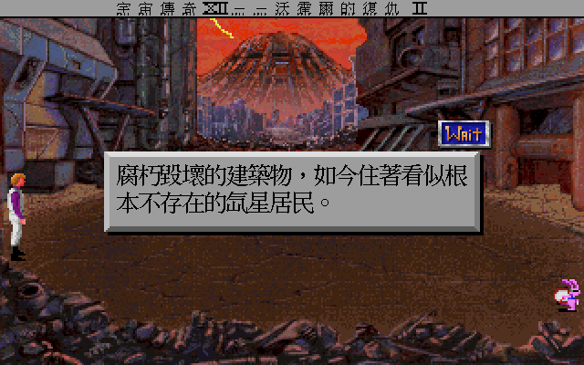

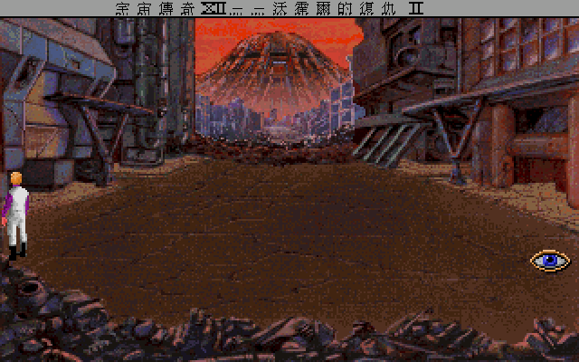

放大看字。24×24 的倚天明體直接寫進 640×400 緩衝區，筆劃是銳利的，不是把 8×8 小字拉大：

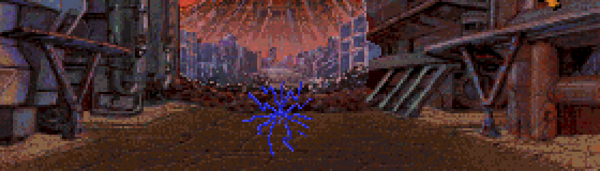

### 狀態列

頂端那條顯示的是遊戲開的玩笑——你正身處「宇宙傳奇 XII：沃霍爾的復仇 II」。
它是 runtime 組出來的字串，含置中用的填充位元組和特殊字型的羅馬數字。


### 暫停面板

按鈕上的字**不是文字，是烘進美術圖的圖案**——這些也重繪成中文了。

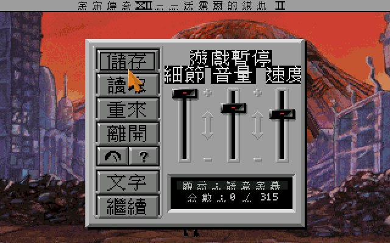

面板右下角那個顯示模式／分數的小框，行距是遊戲寫死的：

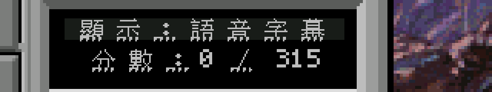

### 圖示指令欄

滑鼠移到畫面頂端會降下來。這排是純圖案，本來就沒有英文字——1992 年那句「無需強背複雜的
動作指令」講的就是它。

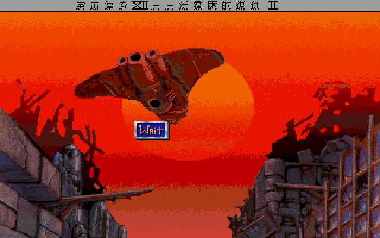

---

<a name="compare"></a>
## 英文原版 ↔ 繁體中文

同一個畫面、同一個時間點，左右各截一張。

| 標題畫面 | 開場詢問 |
|---|---|
| 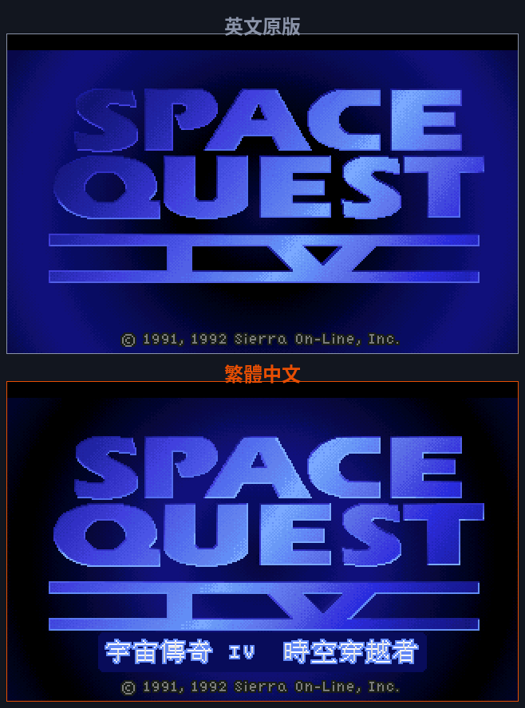 | 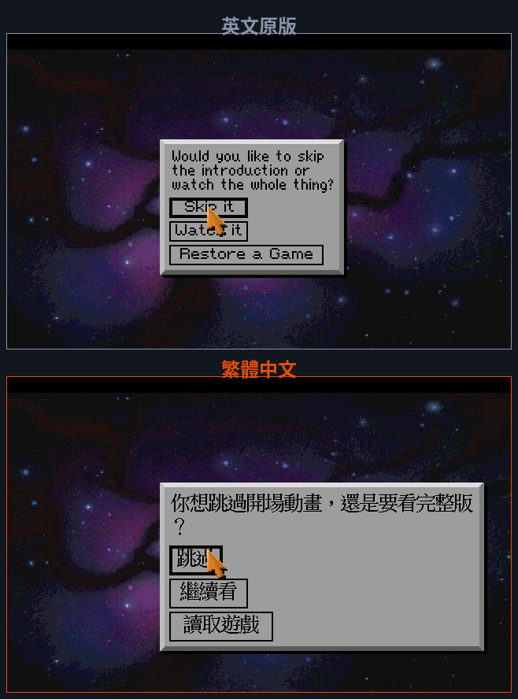 |

| 旁白：這座城市看起來也不一樣了 | 旁白：我現在到底在哪？ |
|---|---|
| 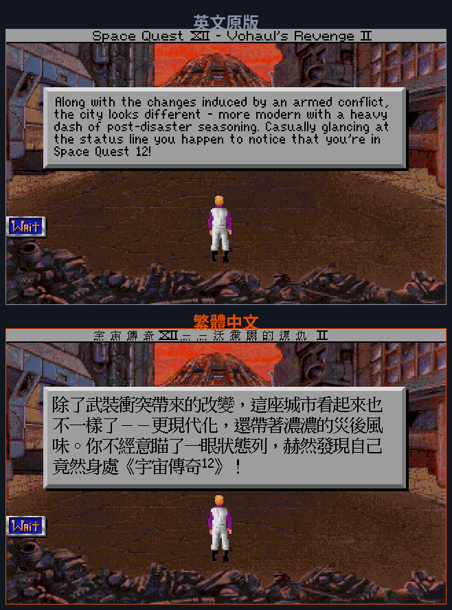 | 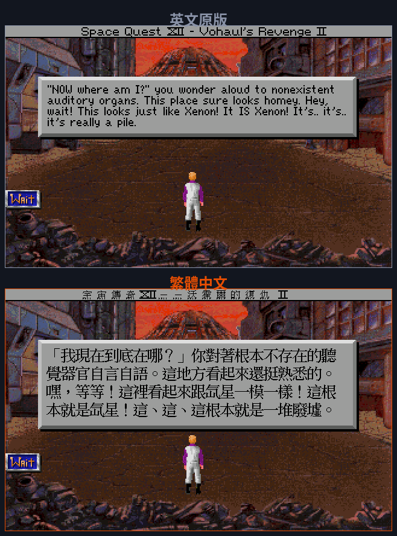 |

| 旁白：到底發生了什麼事？ | 暫停面板 |
|---|---|
| 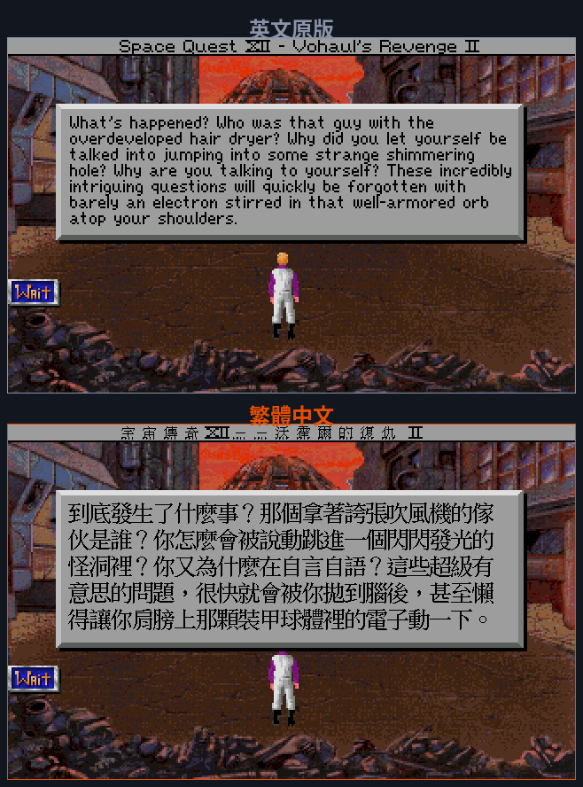 | 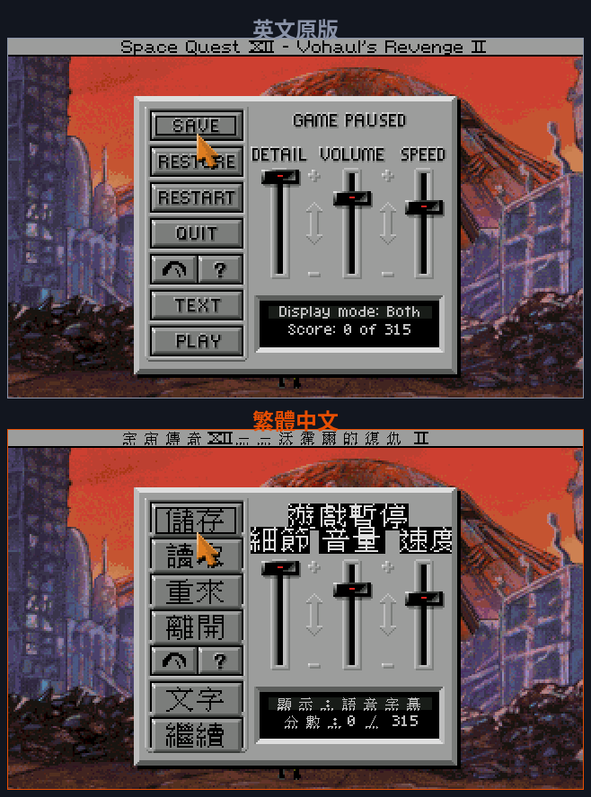 |

值得注意的是版面：中文版沒有為了塞字而縮小視窗或截斷句子，行數是照譯文重算的，
按鈕上的字也維持原本的立體邊框。這件事在引擎裡不是免費的，做法寫在[技術做法](#tech)。

---

<a name="promo"></a>
## 推廣片

靜態截圖看不出捲軸與字幕跟著語音走的節奏，所以另外剪了一支。

84 秒，畫面全是引擎實機截圖，配樂是**原版遊戲音樂**（Munt MT-32 即時側錄，非合成）。

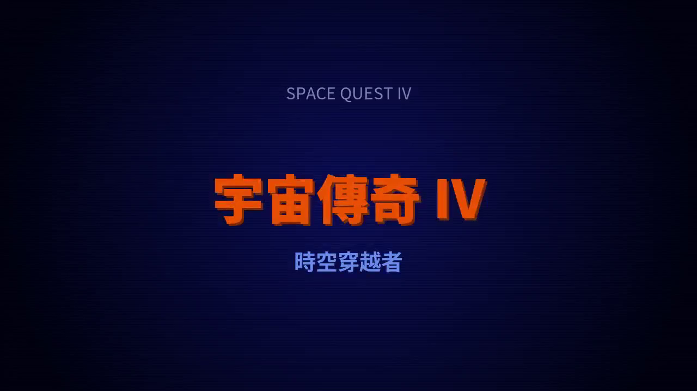

影片本身不放在這個 repo（含遊戲畫面與原作曲者的音樂）。

---

<a name="download"></a>
## 下載

推廣片裡的每一格畫面，裝上補丁後在自己的機器上就是這樣。

[Releases](https://github.com/wicanr2/space-quest4-cht/releases) 有三個平台的補丁包，都**不含遊戲本體**——
你需要自備正版的 Space Quest IV CD 版（`resource.000` / `resource.aud` / `resource.map`；
GOG 與 Steam 的 Space Quest 合輯就是這個版本）。

| 平台 | 檔案 | 怎麼跑 |
|---|---|---|
| Linux x86_64 | `SQ4-CHT-patch-x86_64.AppImage` | `./SQ4-CHT-patch-x86_64.AppImage ~/games/sq4` |
| Windows x86_64 | `SQ4-CHT-patch-win64.zip` | 解壓後把遊戲資料夾拖到「宇宙傳奇4-中文版.bat」上 |
| macOS universal | `SQ4-CHT-patch-macos-universal.dmg` / `.tar.gz` | 見包內 `README-cht.txt`；未簽署，首次要 `xattr -dr com.apple.quarantine` |

啟動器會自動產生一份帶 `language=tw` 的 ScummVM 設定並直接啟動。
**不要改用命令列的 `--language=tw`**：SCI1.1 的偵測器在偵測階段就會用語言過濾條目，
而且 SQ4 CD 同時符合 DOS 與 Windows 兩個偵測條目，`--auto-detect` 只會列出候選、不會啟動。

MT-32 音效：三個包的引擎都編入了 Munt（MT-32 模擬），但 ROM 有版權不隨包散布。
自備 `MT32_CONTROL.ROM` 與 `MT32_PCM.ROM` 放進遊戲資料夾，再到音效選項選 Roland MT-32。

### 驗證到什麼程度

- **Linux AppImage**：實機跑過，中文正常。
- **Windows**：在 Wine 下實測過啟動流程與設定產生（抓到並修掉三個 `.bat` 的 bug），
  但**沒有在真實 Windows 上測過**。
- **macOS**：由 GitHub Actions 的 `macos-14` runner 建置，`scummvm` 與 `libSDL2` 都確認是
  universal（arm64 + x86_64），中文資料五個檔都在 `Contents/Resources/cht-data/`；
  但**沒有在實機 macOS 上開過**。遇到問題歡迎開 issue。

---

<a name="walkthrough"></a>
## 中文攻略

1992 年沒有 GameFAQs 也沒有 wiki，卡關只能靠雜誌的攻略連載、BBS 的討論板，或是花錢買
Sierra 自己出的攻略本。這次直接附一份。

[`docs/walkthrough.md`](docs/walkthrough.md) 是一份繁體中文完整攻略（含劇透警告）。
它照本專案的譯名表寫，跟遊戲裡看到的中文一致。

| 章節 | 內容 |
|---|---|
| [序章：氙星酒吧與時空裂隙](docs/walkthrough.md#序章氙星酒吧與時空裂隙) | 開場過場 |
| [第一章：黑暗未來氙星（初訪）](docs/walkthrough.md#第一章黑暗未來氙星初訪街道地下水道與逃亡) | 街道、地下水道、逃亡 |
| [第二章：艾斯楚斯](docs/walkthrough.md#第二章宇宙傳奇x艾斯楚斯的乳膠美女) | 宇宙傳奇 X 的世界 |
| [第三章：銀河購物中心（初訪）](docs/walkthrough.md#第三章銀河購物中心初訪血拼打工與偷時空艙) | 血拼、打工、偷時空艙 |
| [小遊戲：太空母雞小姐](docs/walkthrough.md#小遊戲一太空母雞小姐ms-astro-chicken) | 操作要領 |
| [小遊戲：巨石漢堡組裝](docs/walkthrough.md#小遊戲二巨石漢堡組裝) | 操作要領 |
| [第四章：尤倫斯荒原](docs/walkthrough.md#第四章尤倫斯荒原宇宙傳奇一代的懷舊之旅) | 宇宙傳奇一代的懷舊之旅 |
| [第五章：黑暗未來氙星（二訪）](docs/walkthrough.md#第五章黑暗未來氙星二訪雷射通道機器人巡邏迷宮與超級電腦決戰) | 超級電腦決戰 |
| [時空艙座標總整理](docs/walkthrough.md#時空艙座標總整理) | 各時空點座標 |
| [死亡總表](docs/walkthrough.md#死亡總表快速查閱) | 所有死法與怎麼避免 |
| [分數表（滿分 315）](docs/walkthrough.md#分數表滿分-315) | 加分點 |
| [彩蛋與致敬](docs/walkthrough.md#彩蛋與致敬) | 系列自嘲梗、其他 Sierra 作品客串 |

攻略是交叉比對多份英文資料後改寫的，並用本專案抽出來的遊戲原文核實過店名、道具與提示。
查不到或來源互相矛盾的地方，文中用 `> 待查證` 標出，沒有編造步驟。

攻略裡最難查的一段是時空艙座標——難的原因不是資料少，是資料互相矛盾。

---

<a name="timepod"></a>
## 時空艙座標全解 ＋ 線上模擬器

**<https://wicanr2.github.io/space-quest4-cht/timepod/>**

時空艙鍵盤能去哪裡，中文圈一直沒有完整整理。原因不只是沒人做——**有一半的座標每個人都不一樣**。

線上模擬器可以先把符號按過一遍，看看會跳到哪裡，不必在遊戲裡手忙腳亂：


### 固定座標

| 座標（按鍵順序） | 目的地 |
|---|---|
|  | **尤倫斯荒原**（room 613）——正規劇情用，前三符號在口香糖包裝紙、後三在攻略本 |
|  | **奧特佳熔岩星球**（room 650）——羅傑會融化，先存檔 |
|  | **我愛露納西**彩蛋動畫 |

這三組寫死在程式裡，每個人、每一輪都一樣。奧特佳那組反過來讀是 `5 4 3 2 1 0`，遊戲內部
就是這樣存的，看起來像開發者留下的測試碼。「我愛露納西」不換場景，播的是一段惡搞老影集
《我愛露西》片頭的動畫。

### 隨機座標

回黑暗未來氙星那組是**每次開新遊戲即時亂數產生的**（`script.803` 開場叫五次 `Random(0,14)`）。
任何攻略寫「氙星座標是這六個」都只是那個人那一輪的結果。遊戲叫你抄下來，是真的要你抄。

### 實機驗證過


照表值原樣按下去竟然被判無效——回頭看顯示格的建立迴圈，x 座標是 `289 − t×7`，
所以 `local[20]` 是**最右邊**那格，比對由右往左，表裡的值要反過來按。反轉後再試就成了。

完整推導、以及為此寫的 SCI1.1 反組譯器，見
[`docs/timepod-coordinates.md`](docs/timepod-coordinates.md)。

### 被剪掉的那個房間，寫回去了

遊戲藏了一個堆滿「Sierra 因法律問題從自家遊戲裡撤掉的東西」的倉庫——**而那個房間本身也被拿掉了**。
CD 版只剩背景圖與對白，程式整包不見，原版跑到這裡會當掉。

本專案自己寫了一個 SCI1.1 組譯器，產生 `271.scr` / `271.hep` 補回去：

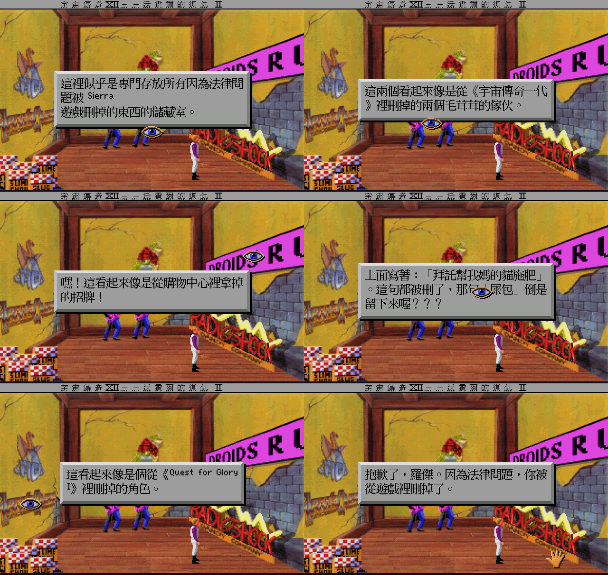

`dist-cht/` 已內含這兩個檔，三平台 patch 包都會帶上，玩家不用做任何事——
ScummVM 偵測到 `script.271` 存在，就會自動停用它那條「停用該座標」的相容性 patch，
那 18 個符號因此自動復活。

房間進得去、可走動、**畫面上九樣東西都能點**、每樣都有自己的中文說明，
對時空艙用「動作」還會觸發那則專屬 bad ending：「抱歉了，羅傑。因為法律問題，你被從遊戲裡刪掉了。」
全部實機驗證過，不當機。

做法與踩過的坑（包含找最久的那個：從範本複製過來的一個欄位讓所有熱區永遠點不到）見
[`docs/room271-restoration.md`](docs/room271-restoration.md)。

---

<a name="copy-protection"></a>
## 防拷

[`docs/copy-protection.md`](docs/copy-protection.md)

時空艙鍵盤按符號、防拷關卡也按符號，兩者長得像，常被搞混，但它們是兩回事。

**這個中文版不會問你防拷問題。** CD 語音版把防拷關卡整個拿掉了——防拷房間的程式
（`script.815` / `heap.815`）在資源裡根本不存在，只剩沒清乾淨的美術與文字。
把 `view.815` 解碼出來就是那台鍵盤本人：

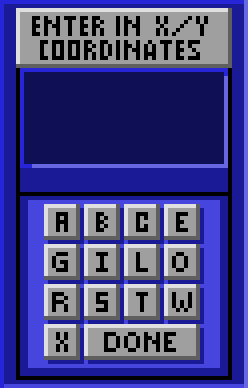

實測開機到可操作全程沒有任何輸入框：

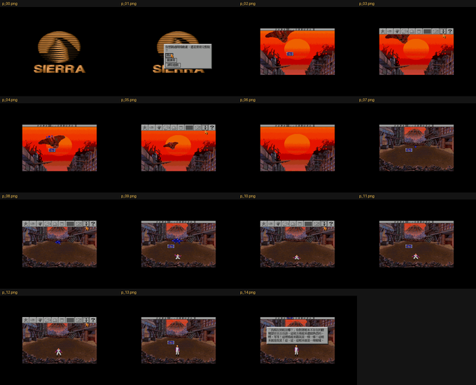

文件裡另外整理了：

| 內容 | 用途 |
|---|---|
| [四項資源層驗證](docs/copy-protection.md#怎麼確定不是還沒走到那一步) | 為什麼確定後段也不會問 |
| [符號座標對照表](docs/copy-protection.md#符號對照表) | 給手上是**軟碟版**的人查 |
| [秘密座標彩蛋](docs/copy-protection.md#秘密座標彩蛋) | 隱藏時空目的地的儀表板符號 |

符號座標對照表是給 1992 年那六片磁碟版的人用的：軟碟版開場會顯示兩個符號，要翻說明書查出
對應的 X/Y 字母才能繼續。手上是 CD 版的話這張表沒有用途，留著是為了保存那套規則本身。

---

<a name="glossary"></a>
## 譯名

人名沿用本團隊《宇宙傳奇 III》繁中版，地名採 1992 年軟體世界代理版中文說明書（珍藏版 96）。
兩邊有出入時的取捨列在下面，完整表在 [`translation/GLOSSARY.md`](translation/GLOSSARY.md)。

| 英文 | 本作採用 | 另一種說法 |
|---|---|---|
| Roger Wilco | 羅傑·威爾科 | 羅傑·威克（1992 說明書） |
| Xenon | 氙星（1992 說明書） | 澤農（SQ3 繁中版） |
| Buckazoids | 太空幣 | — |
| Vohaul | 沃霍爾 | — |
| Pestulon | 佩斯圖倫 | — |
| Two Guys from Andromeda | 仙女座雙傑 | — |
| Sequel Police | 續集警察 | — |
| Monolith Burger | 巨石漢堡 | — |

有趣的是 1992 年那兩份中文文獻自己就對不起來：說明書寫「羅傑‧威克」，同一年的雜誌廣告
與專文寫「羅傑威爾」。這不是誰譯錯，而是那個年代的常態——廣告文案、說明書、雜誌專文常由
不同的人在不同時程各譯一次，中間沒有一張共用的譯名表。專文提到的「美人星」也是同一回事，
指的是遊戲裡的 Estros，走意譯不走音譯；本作採「艾斯楚斯」，「美人星」當作那個時代的痕跡
記在這裡，不列入正式譯名。

翻譯走「梗保留、語氣台化」：專有名詞照表譯成中文但不換指涉（Monolith Burger 是「巨石漢堡」，
不會變成麥當勞），句子用台灣口語寫，美式雙關找中文的等效說法。

---

<a name="manual-1992"></a>
## 1992 年中文說明書要點

當年軟體世界代理版附的中文說明書（手寫排版，24 頁）。掃描本身有版權，不收進這個 repo，
以下是對玩家還有用的部分。

**圖示指令欄**（滑鼠移到畫面頂端會降下來；右鍵循環切換）

| 圖示 | 說明書用語 | 原文 | 作用 |
|---|---|---|---|
| 走路的人 | 行走 | WALK | 點畫面任一處，主角走過去 |
| 眼睛 | 觀看 | LOOK | 看指定的東西，多數劇情描述靠這個觸發 |
| 手掌 | 動作 | ACTION | 拿取物品或對物品操作 |
| 說話的頭 | 交談 | TALK | 跟人或物交談 |
| 鼻子 | 聞 | SMELL | 聞味道 |
| 舌頭 | 嚐 | TASTE | 嚐味道 |
| 目前物品 | 物品欄 | CURRENT OBJECT | 游標變成選定物品的形狀，移到要用的地方使用 |
| 背包 | 查看物品 | INVENTORY | 也可以直接按 `Tab`；裡面有看／動作／選用物品／求助／完畢五個次選項 |

「聞」和「嚐」不是裝飾。Space Quest 很多笑點就藏在對每樣東西聞一次、嚐一次的回應裡，
那是設計者留給願意多按兩下的人的獎勵，也是這系列最吃英文的部分：回應全是純文字，
沒有畫面提示，看不懂就完全感覺不到那裡有東西。這次它們都有中文了。

滑鼠三顆鍵的分工，說明書寫得比多數現代教學清楚：「左按鈕：執行游標指令動作。中按鈕：
切換行走圖形指令游標與上一個圖形指令游標。右按鈕：循環選擇有效的圖形指令。」

說明書的「玩家提示」章有一條在今天讀起來特別有時代感：**繪製地圖**——「將你所到之處、
找到之物品、危險地區，以及所看到的任何線索均記錄在圖上。」那年頭卡關沒有網路可查，
方格紙就是存檔。另外一條到現在仍然有效：遇到過不去的問題，先換個地方，晚點再回來。

說明書裡還印了 Sierra 自己惡搞的假廣告，那些店在遊戲的銀河購物中心真的逛得到：

> 星際購物中心 SOFTWARE EXCESS：本店擁有全部的電腦軟體及相關圖書，想買到最佳的工具程式、
> 遊戲、雜誌或攻略本就到本店來。
>
> Timebuster 2000 SUX 時空穿越者：遊歷群星，全在你的一指之間。
>
> ——1992 年《軟體世界》珍藏系列 96 中文說明書

「Software Excess」是在酸 Software Etc.，「SUX」則是給自家時空艙的評語，翻成中文之後
這兩個梗都還在，因為譯者當年直接保留了英文店名。

---

<a name="font"></a>
## 字型

1992 年的說明書是手寫排版印出來的，字想寫多大就多大；螢幕上的中文沒這種自由，得先有一套
那個年代的點陣字。

用**倚天中文系統 3.53 的原生點陣字**：對白用 24×24 明體（`STD.24M`），狀態列與標題副標用 16×15
（`STDFONT.15`）。1990 年代 DOS 中文長什麼樣，倚天就長什麼樣；現代 TTF 縮到這個尺寸筆劃比例會不對。
全部用到的 2,140 個字倚天都有，**沒有一個字要退回其他字型**。

同一句對白的對照，上為倚天、下為 AR PL UMing：

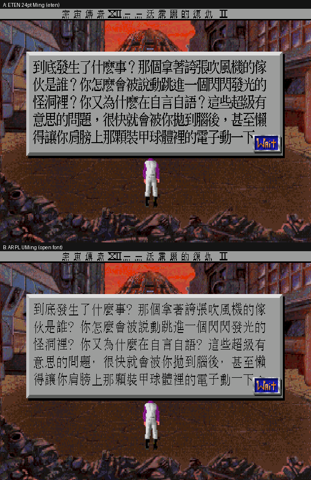

字型檔已包含在 `dist-cht/`，下載後直接可用；它只含本作實際用到的字，不是完整字庫。
排版格與字模尺寸已解耦，**換字型不必重編引擎**，換 `.fnt` 即可
（`tools/build_eten_font.py` 從倚天重烘，`tools/build_cht.py` + `tools/bake_hires_font.py` 從開源字型烘）。

---

<a name="tech"></a>
## 技術做法

字型決定了字長什麼樣，接下來是字怎麼被換掉、又怎麼進到畫面上。

在引擎的繪字咽喉點做**內容比對替換**：拿英文原字當索引查外部的 `translation.tsv`，命中就換成 Big5 中文再畫。
好處是完全不碰原始資源格式，交付物只有 TSV、字型和引擎補丁，原版資源一個位元組都不用改、也不用散布。

幾個 SCI1.1 特有的地方：

- **字串住在 `heap` 不是 `script`**。SCI1.1 把 SCI0 的單一 script 資源拆成 bytecode 和資料段，
  沿用舊工具掃 `script.*` 會整批漏掉玩家看得到的字。
- **狀態列是 runtime 組出來的**，含置中用的填充位元組和特殊字型的羅馬數字，整串查表永遠對不上，
  只能做片段替換。而且那條列只有 10 個掃描列高，24px 的中文字模會被裁掉下緣並溢出到畫面裡——
  狀態列改用 16×15 字模以 1:1 畫進高解析緩衝區才塞得下。
- **視窗大小要用譯文量**。對白視窗的高度是更早的 `kTextSize` 決定的，只在繪製時換中文的話，
  視窗會照英文的行數開，中文較長時就會溢出。
- **按鈕美術字用「加大 cel」而不是「縮小字」**。按鈕圖塊只有 50×15，扣掉立體邊框剩不到 11 像素的
  文字帶；把 cel 加高到 19 像素吃掉按鈕之間的間距，16×15 的倚天字模就原尺寸放得進去。
  立體邊框的像素完全沿用原圖，底色與字色也是從原圖自己統計出來的。
- **要不要走緊湊字模是寫在譯文裡的**（值的開頭放一個 `0x0E` 標記），不是在引擎裡寫死字串清單，
  所以之後遇到別的固定高度小框，補一筆譯文就好。

完整的踩雷紀錄在 [`docs/lessons-sq4.md`](docs/lessons-sq4.md)。

---

<a name="repo"></a>
## 這個 repo 有什麼

只放補丁，**不含遊戲本體**。

| 目錄 | 內容 |
|---|---|
| `patches/` | ScummVM 引擎改動（`0001-sci-cht-zh_twn.patch` + 新增的 `fontchinese.cpp/h`） |
| `dist-cht/` | 執行期中文資料：`translation.tsv`（Big5）、兩份倚天字型、中文標題疊圖 `sq4_title.ovl`、中文化的暫停面板 `view.947` |
| `translation/` | 翻譯原始資料：抽字骨架、UTF-8 譯文、譯名表、批次檔 |
| `tools/` | 抽字、烘字型、合併譯文、重繪按鈕、疊圖、實機擷取、打包、推廣片合成 |
| `docs/` | 實作筆記、中文攻略 |
| `.github/workflows/` | macOS universal（arm64＋x86_64）的 CI build |

分界很清楚：`dist-cht/` 是玩家要複製進遊戲資料夾的執行期資料，`translation/` 與 `tools/`
是產生它們的來源與流程，`patches/` 則是引擎那一側的改動。三者拆開的用意是換譯文或換字型時
不必動引擎，重跑 `tools/` 就好。

自己編：

```bash
tools/apply_patches.sh scummvm-src          # 自動 clone pinned commit 並套 patch
cd scummvm-src
./configure --disable-all-engines --enable-engine=sci --disable-detection-full
make -j$(nproc)                              # MT-32 必須啟用，不要加 --disable-mt32emu
# 把 dist-cht/ 底下所有檔案複製進遊戲資料夾
```

在 `scummvm.ini` 的遊戲條目裡加 `language=tw`：

```ini
[sq4-cht]
engineid=sci
gameid=sq4
path=/path/to/sq4
language=tw
subtitles=true
speech_mute=false
```

---

<a name="credits"></a>
## 授權與致謝

《Space Quest IV》© 1991, 1992 Sierra On-Line, Inc.。本專案與 Sierra / Activision 無任何關聯，
是非商業的繁體中文化與歷史保存。

- **ScummVM**（GPLv3+）：引擎補丁依 GPL 釋出；若釋出修改過的執行檔會一併附上對應原始碼。
- **倚天中文系統**點陣字模：`dist-cht/` 內的 `.fnt` 是本作用到的字的子集，非完整字庫。
- 1992 年中文說明書：《軟體世界》珍藏系列 96；掃描檔版權屬原出版者，不收錄於此。
  文字內容由「軟體世界說明書補完計劃」保存流傳。
- 1992 年《軟體世界》代理版全頁廣告文案，與同年雜誌專文〈宇宙傳奇 IV 時空穿越者〉：
  著作權屬原出版者與 SIERRA。本文只作標明出處的片段引用，掃描件不入 repo。那幾段中文
  是這份專案的起點——沒有當年那位寫「就算是不懂英文也可玩得盡興」的編輯，就沒有這個 repo。
- 致敬 Sierra On-Line 與仙女座雙傑（Scott Murphy、Mark Crowe）。
