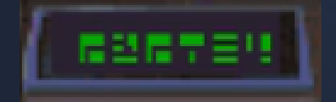
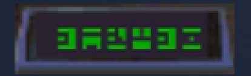
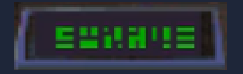
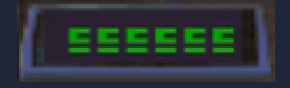

# 防拷、時空艙座標與符號對照

## 這個中文版不會問你防拷問題

《宇宙傳奇 IV》CD 語音版把防拷關卡整個拿掉了，本專案的三平台包沿用同一批遊戲資源，
所以從開機到進遊戲不會出現任何要你翻說明書的畫面。

實測開機序列（Linux 完整版 AppImage，headless 自動操作）：

| 畫面 | 內容 |
|---|---|
| 1 | Sierra logo |
| 2 | 中文詢問「你想跳過那個動畫，還是要看完整版？」 |
| 3–10 | 開場動畫（沃霍爾的復仇結尾 → 續集警察追殺） |
| 11–15 | 直接進入可操作的氙星廢墟，中文旁白正常 |

中間沒有任何防拷輸入框。

### 怎麼確定不是「還沒走到那一步」

開機沒問，不代表遊戲後段不會問。所以另外從資源層面查了一次，結論是**這一版根本沒有能跑防拷的程式碼**：

1. **防拷房間的程式被移除了。**
   SCI 遊戲的每個房間由 `script.NNN` + `heap.NNN` 這對資源構成。防拷是 815 號房間，
   但這一版的資源裡 `script.815` 和 `heap.815` 都不存在——800 到 820 之間其他號碼都在，
   只有 815（和 805）被抽掉。

2. **美術、文字、音效倒是留著沒清。**
   `message.815`、`view.815`、`sound.815` 都還在。把 `view.815` 解碼出來，
   就是那台防拷鍵盤本人：

   

   鍵盤上的字母是 `A B C E G I L O R S T W X` 十三個，正好等於下面那張網格
   「LATEXBABES × ROGERWILCO」用到的字母集合，兩邊完全對得起來。

3. **全遊戲沒有任何一行程式叫得到 815 號房間。**
   掃過全部 203 個 `script.*`，數值 815 只在 `script.070` 出現兩次，形式是
   `pushi 40; push1; pushi 815`——看起來很像 `newRoom: 815`，但 selector 40 不是換房間。
   統計全部 332 次 selector 40 的賦值，有 99/102 個值對得上 `sound.NNN`，
   而 `heap.070` 裡確實有個物件叫 `aSound`。所以那兩處是
   `(aSound number: 815 loop: 127 play:)`，播的是遺留的音效 815。

   真正的換房 selector 是 376（57 個值裡 56 個對得上 `script.NNN`、55 個有對應的 `pic`），
   而**它的值裡沒有 815**。

4. **就算真的叫到了也不會是防拷畫面。**
   `script.815` 不存在，ScummVM 會直接報 script not found 中止，而不是彈出輸入框。

順帶一提，`message.815` 裡那段防拷說明也翻成中文了（Sierra 自己都在吐槽這個機制）：

> 好啦，這就是那個蠢蠢的防拷保護。翻開你的說明書，找出畫面上顯示的兩個符號各自對應的
> X/Y 座標（字母）。點擊對應按鈕或直接打字輸入這四個字母，最後按「完成」或鍵盤上的
> ENTER 鍵結束。

翻是翻了，但玩家永遠不會看到。

---

## 軟碟版的防拷怎麼過

如果你手上是**軟碟版**（不是本專案支援的 CD 語音版），開場會跳出上面那台鍵盤，
畫面上顯示兩個符號，要你輸入四個字母。

### 規則

說明書裡有一張 10×10 網格：

- **橫軸（X）**由上而下是 `L A T E X B A B E S`
- **縱軸（Y）**由左而右是 `R O G E R W I L C O`
- 每格填一個數學符號，對角線是空的

答案 = **欄字母（X）＋ 列字母（Y）**。例如 `LSMFT` 這格在 T 欄、R 列，答案就是 `TR`。
畫面顯示兩個符號，各查出兩個字母，合起來四個字母。

### 符號對照表

同一個符號可能出現在多格，這種情況下面列出全部可能的答案。

**數學符號類**

| 符號 | 座標 |
|---|---|
| ⊘ / I（斜線圓上下疊 I） | AL |
| ⊘（斜線圓） | XO、BO、EG |
| Ø183 | ER |
| Φ | EL |
| π | LO |
| π² | EI |
| √π | AO |
| √117 | XI |
| √2x | EL |
| √b² | LC |
| √n ⁄ x | TI |
| √X ⁄ √N | AG |

**數字開頭**

| 符號 | 座標 |
|---|---|
| 1 x | EW |
| 10 u | EO |
| 15X | BR |
| 18 x | EI |
| 11743 | ER |
| 2A² | AI |
| 2x³ | LI |
| 3√G | XW |
| 3 L | LO |
| 3⁰+ | SL |
| 32⁰ | SC |
| 33 ⁄ 139x | XC |
| 4x² | LW |
| 485 ⁄ EA | AE |
| 4392 | AO |
| 5 ⁄ x | AG |
| 5 x | LG |
| 5x ⁄ 9 | TO |
| 8(b-r) | AR |
| 9 x | LE |
| 9x ⁄ R | AE |

**小寫字母開頭**

| 符號 | 座標 |
|---|---|
| ax²+c | AC |
| b²-4ac | EO |
| bⁿ | TC |
| e=mc₂ | TE |
| ex² | XE |
| mvp³ | SG |
| n=? | TW |
| n² ⁄ x² | TL |
| nx | EO |
| x + 4 | LR |
| (x+y) ⁄ 2 | AO |
| x $ | BO |

**大寫字母（非分數）**

| 符號 | 座標 |
|---|---|
| BEx | BE |
| B I | BI |
| BOˣ | BO |
| BR² | BR |
| F 1 | SW |
| GGx | AR |
| I B | BI |
| LSMFT | TR |
| N/A | BO |
| R²-e | ER |
| Rₓ | SR |
| RATA | AR |
| RLL | LL |
| SRL x 9 | XL |
| TBA | BR |
| VI.3 | BC |
| X | XG、AW、EC |
| X-5% | SE |
| X-10% | BC |

**大寫字母（分數形式）**

| 符號 | 座標 |
|---|---|
| A10 ⁄ TNK | SI |
| BLT ⁄ OA | TO |
| BW ⁄ B | BW |
| EG ⁄ 4 | EG |
| F7 ⁄ 2 | BR |
| GM ⁄ AC | AC |
| GPA ⁄ EE | EE |
| KQV ⁄ SRL | EW |
| LB ⁄ J | BL |
| MT ⁄ M | SO |
| PG ⁄ E | AL |
| PGA ⁄ RA³ | AR |
| RE ⁄ √3 | ER |
| Rx ⁄ T | TR |
| THX ⁄ 1138 | XO |
| TSN ⁄ 40² | SR |
| V ⁄ V | BG |
| WA ⁄ AO | AW |
| X ⁄ CTA | BG |
| XX ⁄ X² | EO |

輸完按畫面上的「完成」或鍵盤 Enter。答錯會給第二次機會。

---

## 時空艙座標不是防拷

這兩件事常被搞混。**時空艙座標是遊戲內謎題**，不管哪個版本都要解，跟防拷無關：

- 座標寫在時空艙儀表板上，遊戲不會幫你存，得自己抄下來
- 「尤倫斯荒原」的六位座標拆成兩半：翼龍巢穴續集警察屍體身上的**口香糖包裝紙**（3 個符號）
  ＋銀河購物中心買到的**攻略本**（3 個符號）
- 詳細流程見 [完整攻略](walkthrough.md#時空艙座標)

### 秘密座標彩蛋

遊戲藏了幾組不影響破關的隱藏目的地，輸入下列符號組合就會過去。
**先存檔**——有幾個地方會直接害死羅傑。

| 目的地 | 儀表板符號 |
|---|---|
| 《宇宙傳奇 12》黑暗未來氙星 |  |
| 《宇宙傳奇 10》太空幣比爾遊樂場 |  |
| 《宇宙傳奇 3》 |  |
| 《宇宙傳奇 10》翼龍巢穴 |  |

《宇宙傳奇 1》那組座標社群目前仍未整理出來。

座標用的是遊戲自己的符號字集，沒有對應的英數字，只能照圖按。
這幾組來自社群整理的資料，本專案沒有逐一實測。

---

## 資料來源與版權

- 符號對照表整理自玩家社群流傳的 *SQ4 Copy Protection, Sorted by Symbol*，
  原始資料出自 1991 年 Sierra 隨遊戲附的說明書。
- 說明書掃描本身有著作權，**不收進本 repo**，與其他手冊掃描一致（見 [NOTICE](../NOTICE.md)）。
  這裡只保留轉成文字的查表資料。
- 時空艙符號圖為遊戲畫面內容，版權屬 Sierra On-Line。
- 防拷鍵盤圖由本專案自行從遊戲資源 `view.815` 解碼產生
  （工具：[`tools/sci_view.py`](../tools/sci_view.py)）。
