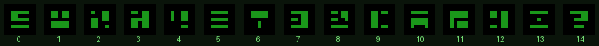
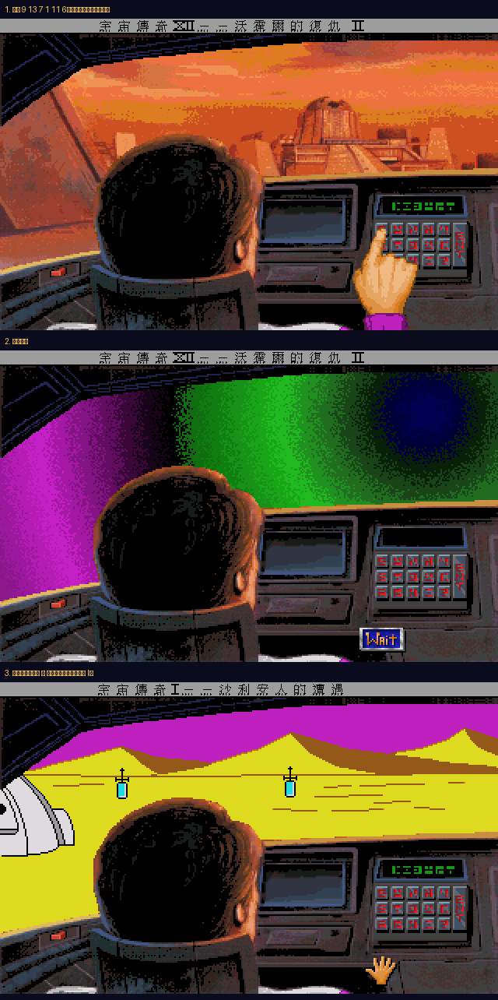

# 時空艙座標全解

《宇宙傳奇 IV》的時空艙鍵盤能去哪裡，一直沒有完整的中文整理。原因不只是懶得整理——**其中一半的座標每個人都不一樣**。

這份資料不是抄社群，是把遊戲的 `script.531` / `heap.531` 反組譯讀出來的，並在實機上按過確認。

> **想先試按？** 線上模擬器：<https://wicanr2.github.io/space-quest4-cht/timepod/>
> 按下符號就會跳到對應場景，不必在遊戲裡手忙腳亂。

---

## 15 個符號

鍵盤是 5 欄 × 3 列，符號沒有對應的英數字，只能照樣子按。下面的編號是本文件用的代號（也是遊戲內部的索引）：



**符號從右邊擠進來。** 讀數螢幕有 6 格，每按一次，新符號進到最右邊、舊的往左推。所以你按的順序，就是螢幕上由左到右讀出來的順序。本文所有座標都照按鍵順序列。

---

## 固定座標

寫死在遊戲程式裡，每個人、每一輪都一樣。

| 座標 | 目的地 | 房號 | 說明 |
|---|---|---|---|
| <br>`9 13 7 1 11 6` | **尤倫斯荒原**（《宇宙傳奇 I》） | 613 | 正規劇情要用的。前三個符號在艾斯楚斯翼龍巢穴的口香糖包裝紙上，後三個在銀河購物中心買到的攻略本上 |
| <br>`0 1 2 3 4 5` | **奧特佳**（熔岩星球，《宇宙傳奇 III》） | 650 | 沒有保暖裝備，羅傑一下艙就融化。**先存檔** |
| <br>`11 1 9 6 14 4` | **我愛露納西** | — | 不換場景，播一段惡搞老影集《我愛露西》片頭的動畫 |

奧特佳那組反過來讀是 `5 4 3 2 1 0`——遊戲內部就是這樣存的，看起來像開發者留的測試碼。

---

## 隨機座標：為什麼沒有攻略列得出來

回黑暗未來氙星的那組座標，是**每次開新遊戲即時亂數產生的**。

遊戲一開場，`script.803` 跑了這段：

```
013e: pTos 36              ; for i = 1..5
0145: push2; push0; pushi 14
0149: callk 60 4           ; kRandom(0, 14)
014f: sagi 173             ; global[173 + i] = 亂數
```

最後一個符號固定（global 173 的預設值 = 10），前面五個各叫一次 `Random(0,14)`。時空艙儀表板顯示的就是這組值。

**你的座標和別人的不一樣。** 任何攻略上寫「氙星座標是這六個」，都只是那個人那一輪的結果。遊戲裡叫你抄下來，是真的要你抄。

| 座標 | 目的地 | 房號 | 怎麼來的 |
|---|---|---|---|
| 前五個亂數 + 末碼固定 | 續集警察調度中心（黑暗未來氙星） | 530 | 全域變數 173–178，開新遊戲時生成 |
| 前五個亂數 + 末碼 `2` 或 `13` | 太空幣比爾遊樂場 | 376 | 全域變數 179–184，在艙內記下座標時生成 |
| 你自己輸入的那組 | 艾斯楚斯 | 305 | 全域變數 122–127 |

---

## 被剪掉的那一站

連續輸入三組座標（共 18 個符號），會通往一個堆滿「因法律理由被 Sierra 從遊戲裡拿掉的東西」的房間。

| 順序 | 座標 |
|---|---|
| 第 1 組 |  `3 8 6 9 0 2` |
| 第 2 組 |  `2 5 8 6 4 4` |
| 第 3 組 |  `0 0 0 0 0 6` |

中間任何一組輸錯，三個旗標全部歸零，得從頭來。

**這個彩蛋在 CD 語音版進不去。** 房間的程式（`script.271`、`heap.271`）被移除了，只剩背景圖（`pic.570`）和對白（`message.271`）留在資源裡——原版跑到這裡會找不到房間直接當掉。ScummVM 偵測到沒有 `script.271` 就停用這組座標（`script_patches.cpp` 的 `CD: disable timepod code for removed room`，修的是 bug #11006），所以在本專案的包裡按下去只會沒反應，不會壞掉。

房間裡的告示牌寫著：

> 這裡好像是專門堆放 Sierra 遊戲裡因法律理由被拿掉的東西的倉庫。

而那個房間本身也被拿掉了。裡面還有一則專屬死法：

> 抱歉，羅傑。因為法律理由，**你**被踢出遊戲了。

**本專案把這個房間寫回去了。** 自己寫了一個 SCI1.1 組譯器產生 `271.scr` / `271.hep`，
`dist-cht/` 已內含，三平台 patch 包都會帶上——ScummVM 偵測到 `script.271` 存在就會自動
停用那條「停用該座標」的 patch，這組座標因此自動復活。做法與現況見
[把倉庫寫回遊戲](room271-restoration.md)。

想先看它長什麼樣，[線上模擬器](https://wicanr2.github.io/space-quest4-cht/timepod/)有背景圖。

---

## 怎麼查出來的

### 1. 找到時空艙那一間

從訊息文字反查：「這是個手動鍵盤」「什麼事都沒發生。那個代碼一定是無效的」都在 `message.531`，所以時空艙是 531 號房。

### 2. 讀 heap 的 local 變數

`heap.531` 有 117 個 local。要正確切出來得先知道格式——這裡有個坑：ScummVM 原始碼寫的是「物件區起點 = `4 + heap[2]*2`」，但那是相對於它內部的 `_heap`，比 `SCI_DUMP_RES` 倒出來的檔案少 2 bytes。實測（拿三個 heap 交叉驗證，預測值與第一個 `0x1234` 物件標記完全吻合）在檔案上是：

```
localsCount = uint16 @ 4
locals[i]   = uint16 @ 6 + i*2
物件區起點  = 6 + localsCount*2
```

切出來之後結構就清楚了：

| local | 內容 |
|---|---|
| L27–L56 | 15 顆按鍵的螢幕座標（x ∈ {245,255,265,275,285}，y ∈ {129,139,149}）→ 5 欄 × 3 列 |
| L57 起 | 座標表 A，每 6 個一組 |
| L94 起 | 座標表 B，三段式序列用 |

### 3. 反組譯比對函式

`script.531` 的 `0x1293` 是比對函式：

```
1296: ldi 0 ; lali 20 ; send 4     ; local[20+k] 的第 4 號屬性(= 符號索引)
129d: lap 1 ; lali 57              ; 跟 local[57 + 參數 + k] 比
12a1: eq? ; bnt →失敗
```

呼叫端傳偏移量，比中就 `ldi <房號>`：

| 偏移 | 表值 | 房號 |
|---|---|---|
| 0 | 玩家記下的（runtime） | 305 |
| 6 | 全域 122–127 | 305 |
| 12 | 全域 179–184 | 376 |
| 18 | 全域 173–178 | 530 |
| 24 | `6 11 1 7 13 9` | 613 |
| 30 | `4 14 6 9 1 11` | 我愛露納西 |

### 4. 差點誤判的地方

掃全部 203 個 script 找常數 815（防拷房）時，`script.070` 有兩處 `pushi 40; push1; pushi 815`——位元組型態跟 `newRoom: 815` 一模一樣。

沒有 `vocab.997` 可查 selector 名字，就用統計反推：把每個 selector 的所有賦值收集起來，看值落在哪一類資源。selector 40 的值有 99/102 對得上 `sound.NNN`（而 `heap.070` 裡正好有個物件叫 `aSound`）→ 是 `number`，那兩處在播音效。真正的換房 selector 是 376——這點後來在 `script.803` 得到直接證實：`global2.sel376(global107)` 就是換房呼叫。

**位元組型態不能當語意證據。** 一參數 send 的序列本來就長一樣。

### 5. 實機驗證，然後發現順序是反的

照表值原樣按 `6 11 1 7 13 9`，讀數螢幕顯示的 6 個符號跟預期一模一樣，遊戲卻說無效。

回頭看顯示格的建立迴圈：

```
01d7: pushi 153 ; push2 ; pushi 289 ; lst t ; ldi 7 ; mul ; sub
                                     ; x = 289 - t*7
01ff: sali 20                        ; local[20+t]
```

**x = 289 − t×7**，所以 `local[20]` 是最右邊那格，比對是由右往左。表裡的值要反過來按。

反轉後再試一次：



引擎啟動 → 時空亂流 → 黃色沙漠，狀態列跟著變成《宇宙傳奇 I — 沙利安人的邂逅》。尤倫斯荒原，room 613。

---

## 工具

反組譯器是為了這件事寫的，規格逐條對照 ScummVM 原始碼，沒有自己發明：

- [`tools/sci11_disasm.py`](../tools/sci11_disasm.py) — SCI1.1 反組譯 / heap local 與物件解析
- [`tools/sci_view.py`](../tools/sci_view.py) — `.v56` / `.p56` 解碼（符號圖與目的地背景都是這樣抽的）

```bash
python3 tools/sci11_disasm.py locals heap.531
python3 tools/sci11_disasm.py disasm script.531 --start 0xee
```

---

## 相關

- [線上模擬器](https://wicanr2.github.io/space-quest4-cht/timepod/)
- [完整攻略](walkthrough.md)
- [防拷說明](copy-protection.md)——防拷跟時空艙座標是兩回事，本版沒有防拷
